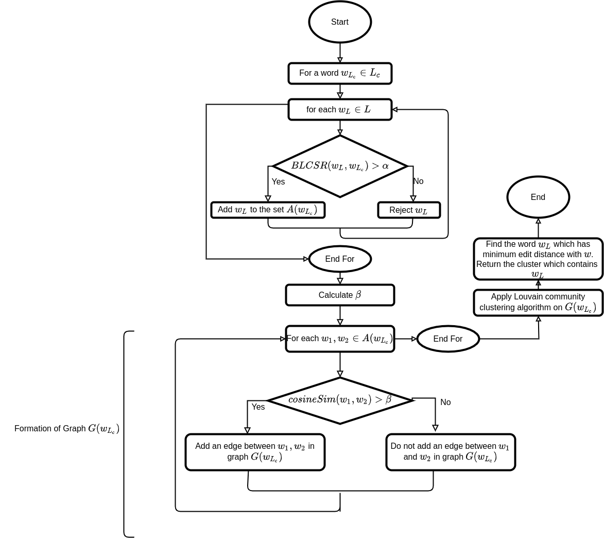

# UnsupClean

## Table of Contents

* [Summary](#summary)
* [Dependencies](#dependencies)
* [Hyperparameters and Options](#hyperparameters-and-options)
* [Data for Demo](#data-for-demo)
* [Run Demo](#run-demo)

### Summary
Implementation of the proposed algorithm in the paper **An Unsupervised Normalization Algorithm for Noisy Text: A Case Study for Information Retrieval and Stance Detection** by Anurag Roy, Shalmoli Ghosh, Kripabandhu Ghosh, Saptarshi Ghosh

### Dependencies
python version: `python 2.7`

packages: 
- `networkx`
- `gensim`
- `python_louvain`
- `community`
- `scikit_learn`

To install the dependencies run `pip install -r requirements.txt`

### Hyperparameters and Options
Hyperparameters and options in `main.py`.

- `wordvec_file` Word vectors file containing vector representation for each words in the lexicon in google word2vec text format
- `cooccur_dict` Pickle file of a python dictionary which has word tuples as its key and their co-occurance counts as its corresponding value
- `alpha` The alpha value used in the algorithm  \[0, 1\]
- `output_fname` Name of the output file where the word clusters will be stored
- `nprocs` Number of parallel processes(the algorithm can be run parallely)
- `stopword_list` File containing stopwords with one stopword in each line(optional)

### Data for Demo
1. TODO
  
### Run Demo
`python2 unsupclean.py -w2v_model w2v_risot_iter100.txt -alpha 0.56 -output_fname risot_output_test.txt -nprocs 4 --stopword_list stopwords_list_ben.txt -cooccur_dict cooccurData.pkl`

